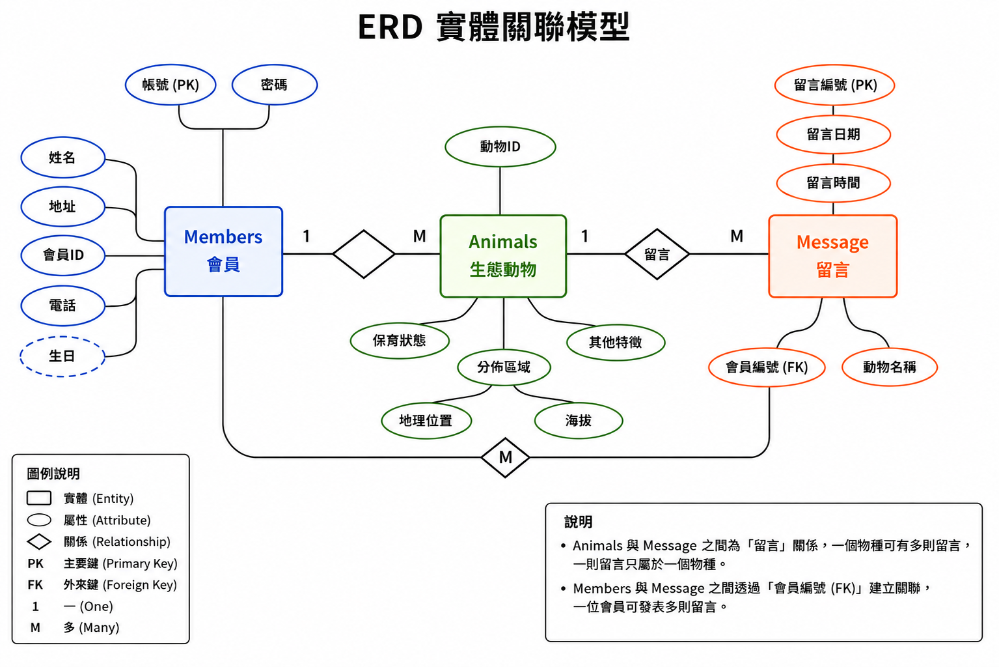
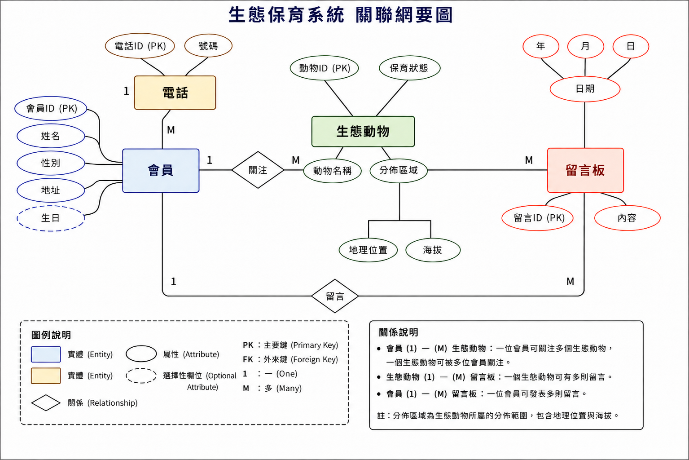

# 🌿 台灣生態保育資訊系統
(Taiwan Ecological Conservation System)

## 專案介紹 (Project Introduction)

本專案為個人開發的 **Web 資料庫系統**，以台灣生態保育資訊為主題，使用 **HTML、JavaScript、PHP 與 MySQL** 建立前端網頁、後端功能與資料庫整合。

系統主要整合生態物種資料管理、條件查詢、會員功能、生態留言板及物種數據分析，使使用者可以透過網頁快速查詢台灣生態動物的保育狀態、分布區域及相關資訊。

本專案主要用於練習與實作：

- Web 前端頁面開發
- PHP 後端程式設計
- MySQL 資料庫建立與操作
- SQL 查詢與資料篩選
- 前後端與資料庫整合
- 動態資料呈現與視覺化

## 系統特色 (System Features)

本系統整合生態資訊管理、資料查詢與互動功能，主要特色如下：

- 🐾 **生態物種資料管理**：管理動物名稱、保育狀態、分布區域及地理位置等資訊。
- 🔍 **多條件資料查詢**：可依物種、保育狀態、地理區域及海拔等條件進行搜尋。
- 👤 **會員功能**：提供會員註冊、登入及基本資料管理。
- 💬 **生態留言板**：提供使用者進行生態保育相關留言與交流。
- 📊 **數據分析**：透過動態表格與長條圖呈現不同分類下的物種數量與分布情況。
- 🗄️ **資料庫整合**：透過 PHP 與 MySQL 完成網頁與資料庫之間的資料讀取、查詢與管理。

## 開發技術 (Tech Stack)

本系統採用 Web 前後端與資料庫整合方式進行開發，主要分為 **前端技術、後端技術與資料庫** 三個部分，並搭配 Apache Web Server 建立網站運作環境。

| 類別 | 技術 | 主要用途 |
| --- | --- | --- |
| Frontend | HTML、JavaScript | 建立網頁結構、動態互動、表單與資料呈現 |
| Backend | PHP | 處理系統邏輯、使用者請求及資料庫操作 |
| Database | MySQL | 儲存與管理會員、動物及留言等系統資料 |
| Web Server | Apache | 提供網站與 PHP 程式的伺服器執行環境 |
| Development Tool | Visual Studio Code | 網頁與程式碼開發 |
| Browser | Google Chrome | 系統操作、功能測試與網頁顯示 |

### 技術整合方式

系統前端使用 **HTML 與 JavaScript** 建立網頁介面與互動功能，後端透過 **PHP** 處理系統邏輯及前端傳送的資料，並與 **MySQL** 資料庫進行連接，完成資料的查詢、新增、修改與刪除等操作。

JavaScript 除了負責前端互動與動態內容呈現，也配合 PHP 進行前後端資料傳遞與功能整合。

整體系統透過 **Apache Web Server** 提供網站執行環境，使前端、後端與資料庫能夠相互整合，形成完整的 Web 資料庫系統。

**Frontend（HTML / JavaScript） → Backend（PHP） → Database（MySQL）**

## 系統架構 (System Architecture)

本系統採用 **三層式架構（3-Tier Architecture）** 進行設計，將 Web 系統依功能分為 **使用者介面層（Presentation Layer）**、**運算邏輯層（Business Logic Layer）** 與 **資料服務層（Data Layer）**。

透過分層架構將網頁介面、系統邏輯與資料庫功能分開處理，使整體系統架構更加清楚，並有助於後續功能整合、維護與資料管理。

### 系統運作流程

```text
使用者 (User)
      ↓
HTML / JavaScript
使用者介面層 (Presentation Layer)
      ↓
PHP
運算邏輯層 (Business Logic Layer)
      ↓
MySQL
資料服務層 (Data Layer)
      ↓
資料查詢 / 新增 / 修改 / 刪除
      ↓
PHP 處理結果
      ↓
回傳至網頁顯示
```

## 主要功能 (Main Features)

本系統以台灣生態保育資訊管理為核心，整合會員管理、生態動物資料、條件查詢、留言互動及數據分析等功能，讓使用者能透過網頁瀏覽與查詢相關生態資訊。

系統主要功能如下：

| 功能 | 說明 |
| --- | --- |
| 👤 會員系統 | 提供會員註冊、登入及基本資料管理功能 |
| 🐾 生態動物寶庫 | 建立生態動物資料，呈現物種名稱、保育狀態、分布區域及相關資訊 |
| 🔍 生態百科查詢 | 依保育狀態、分布區域及地理條件搜尋相關物種資料 |
| 💬 生態留言板 | 提供使用者留言與生態保育相關資訊交流功能 |
| 📊 物種數據分析 | 透過資料表與長條圖呈現物種分類、分布及相關統計資訊 |

透過上述功能，將前端網頁、PHP 後端程式與 MySQL 資料庫進行整合，使生態資料能夠進行查詢、管理與視覺化呈現。

## 資料庫設計 (Database Design)

本系統使用 **MySQL** 建立關聯式資料庫，作為會員資料、生態動物資訊及留言資料等系統資料的主要儲存與管理方式。

資料庫設計透過 **實體關聯模型（Entity Relationship Diagram, ERD）** 規劃各資料實體及其關聯，並依照系統功能建立對應的資料表、Primary Key 與 Foreign Key，使不同功能之間的資料能夠進行關聯與存取。

本系統主要資料表包含：

| 資料表 | 用途 |
| --- | --- |
| `Members` | 儲存會員基本資料 |
| `Animals` | 儲存生態動物相關資訊 |
| `Message` | 儲存生態留言板資料 |

透過 PHP 與 MySQL 的整合，系統可依照不同功能需求執行資料的新增、查詢、修改與刪除，並將處理結果動態呈現在網頁介面中。

### ERD 實體關聯模型 (Entity Relationship Diagram)

為了清楚呈現系統中各項資料之間的關係，本系統建立 **ERD（Entity Relationship Diagram）**，用於規劃資料實體、屬性以及實體之間的關聯。

ERD 主要以 **Members（會員）**、**Animals（生態動物）** 與 **Message（留言）** 等資料實體為核心，並透過 Primary Key（PK）與 Foreign Key（FK）建立資料之間的關聯。

透過 ERD 的設計，可在建立實際資料表之前先確認各項資料的結構與關聯方式，並作為後續關聯綱要、資料表及資料庫建置的設計基礎。

<p align="center">
  
</p>

<p align="center">
  <b>圖 1　ERD 實體關聯模型</b>
</p>

### 關聯綱要 (Relational Schema)

根據 ERD 實體關聯模型，本系統進一步建立 **關聯綱要（Relational Schema）**，將系統中的實體、屬性及關聯轉換為實際的資料表結構。

關聯綱要主要呈現 **Members（會員）**、**Animals（生態動物）** 與 **Message（留言）** 等資料表之間的關聯，並透過 **Primary Key（PK）** 與 **Foreign Key（FK）** 建立資料表之間的連結。

透過關聯綱要可以更清楚了解各資料表的欄位配置與資料關聯方式，並作為後續 MySQL 資料表建立及系統資料存取的設計依據。

<p align="center">
  
</p>

<p align="center">
  <b>圖 2　關聯綱要圖</b>
</p>

### 資料表欄位設計 (Table Structure)

#### Members（會員資料表）

`Members` 資料表主要用於儲存系統會員的基本資料，並以會員 ID 作為會員資料的識別依據。

會員資料包含姓名、密碼、生日及地址等資訊，供系統進行會員資料管理及相關功能使用。

| 欄位 | 資料型態 | 說明 |
| --- | --- | --- |
| `mid` | `CHAR(6)` | 會員 ID，作為會員資料的主要識別欄位（Primary Key） |
| `name` | `NVARCHAR(10)` | 會員姓名 |
| `phone` | `VARCHAR(10)` | 會員電話 |
| `address` | `NVARCHAR(30)` | 會員地址 |
| `birthday` | `DATE` | 會員生日 |

透過 `Members` 資料表，可集中管理會員基本資訊，並作為會員與系統其他資料產生關聯時的資料基礎。

#### Animals（生態動物資料表）

`Animals` 資料表主要用於儲存系統中的生態動物資訊，作為 **生態動物寶庫、生態百科查詢及物種數據分析** 等功能的主要資料來源。

資料內容包含動物 ID、動物名稱、保育狀態、分布區域、地理位置及海拔等相關資訊，使系統能依照不同條件進行物種資料的查詢、篩選與呈現。

| 欄位 | 資料型態 | 說明 |
| --- | --- | --- |
| `aid` | `CHAR(5)` | 動物 ID，作為動物資料的主要識別欄位（Primary Key） |
| `aname` | `NVARCHAR(20)` | 動物名稱 |
| `region` | `NVARCHAR(20)` | 動物的分布區域 |
| `location` | `NVARCHAR(30)` | 動物的地理位置 |
| `status` | `NVARCHAR(10)` | 動物的保育狀態，預設值為「未分類」 |

透過 `Animals` 資料表，可集中管理不同生態動物的相關資訊，並配合 PHP 與 MySQL 查詢功能，提供使用者依照不同條件搜尋及瀏覽物種資料。

#### Message（生態留言板資料表）

`Message` 資料表主要用於儲存系統中生態留言板的留言資料，記錄留言者、留言日期及留言內容等資訊。

其中以 `msgID` 作為每筆留言資料的主要識別欄位，並透過 `mid` 與 `Members` 會員資料表建立關聯，使系統能夠記錄每筆留言所對應的會員。

| 欄位 | 資料型態 | 說明 |
| --- | --- | --- |
| `msgID` | `char(6)` | 留言 ID，作為留言資料的主要識別欄位（Primary Key） |
| `mid` | `char(6)` | 留言者 ID，與會員資料表建立關聯（Foreign Key） |
| `date` | `date` | 記錄留言日期 |
| `content` | `text` | 儲存留言內容 |

透過 `Message` 資料表與 `Members` 資料表之間的關聯，可將留言內容與會員資料進行連結，作為生態留言板功能的資料儲存基礎。

## 系統功能展示 (System Demonstration)

本系統包含會員系統、生態動物典藏、搜尋功能、生態留言板及數據分析等主要簡易功能。

詳細的系統操作流程與功能畫面請參考：

👉 [查看完整系統功能展示](System_demo/)
