# 🖥️ 系統功能展示 (System Demonstration)

本區域展示「台灣生態保育資訊系統」的主要功能與實際操作畫面，並依照系統操作流程介紹各項功能。

功能展示順序如下：

1. 👤 會員系統
2. 🐾 典藏系統
3. 🔍 搜尋功能
4. 💬 客服系統（留言板）
5. 📊 數據分析
6. 🌿 網站首頁

---

## 1. 👤 會員系統 (Member System)

會員系統依使用者身分區分為 **訪客、會員與管理者**，並提供不同的系統操作權限。

主要功能包含 **會員註冊、登入、忘記密碼及個人資料管理**，會員登入後可查詢與修改基本資料，管理者則可進行會員資料管理。

> **本功能展示以管理者身分進行操作與畫面說明。**

### 功能操作畫面

  

  <b>圖 1　會員註冊與登入入口</b> 
  使用者可由系統首頁進入會員功能，進行會員登入或註冊。

  

  

  <b>圖 2　會員資料頁面</b> 
  登入後可查看會員基本資料，並提供修改資料、刪除帳號及登出等操作。

  

  

  <b>圖 3　會員資料修改</b> 
  會員可修改個人資料，完成後將更新內容儲存至資料庫。

  

  

  <b>圖 4　會員註冊</b> 
  新使用者可輸入帳號、密碼、姓名及地址等資料建立會員帳號。

 

---

## 2. 🐾 典藏系統 (Collection System)

典藏系統主要用於管理與呈現生態動物資料，提供物種資訊的新增、分類與瀏覽功能。

每筆動物資料包含 **動物名稱、保育狀態、分布區域及地理位置** 等資訊，讓使用者可以快速了解不同物種的基本資料與保育情況。

### 功能操作畫面

  

  <b>圖 5　生態動物寶庫入口</b> 
  使用者可由系統首頁進入生態動物寶庫，瀏覽與查詢生態物種資訊。

  

  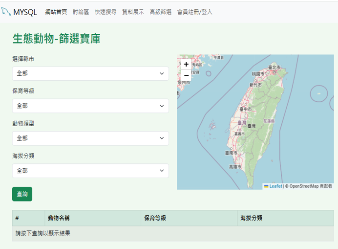

  <b>圖 6　生態動物篩選寶庫</b> 
  系統提供縣市、保育等級、動物類型及海拔分類等條件，並搭配地圖呈現物種資訊。

  

  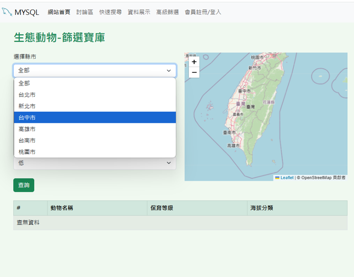

  <b>圖 7　縣市條件篩選</b> 
  使用者可透過下拉選單選擇不同縣市，作為物種資料的篩選條件。

  

  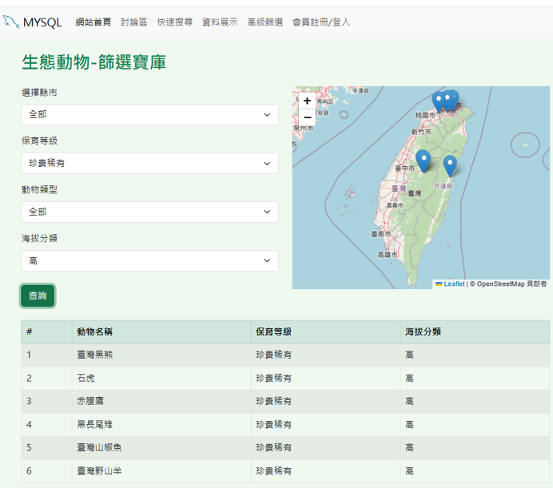

  <b>圖 8　物種篩選結果</b> 
  完成條件設定後，系統會顯示符合條件的物種資料，並於地圖標示相關位置。

  

  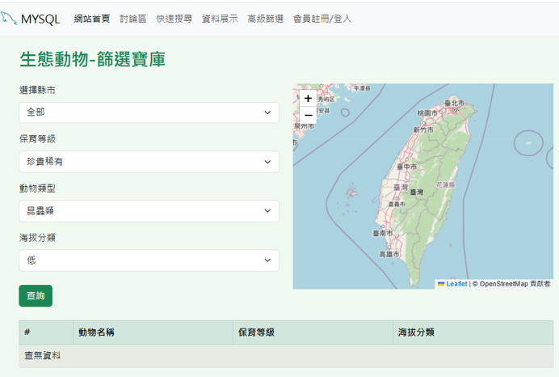

  <b>圖 9　查無符合條件資料</b> 
  當篩選條件沒有符合的物種資料時，系統會顯示查無資料的結果。

 

---

## 3. 🔍 搜尋功能 (Search Function)

搜尋功能提供生態動物的 **關鍵字搜尋**，使用者可輸入動物名稱進行搜尋，快速取得符合條件的物種資料。

搜尋結果會呈現動物名稱、分類、棲息地、保育狀態及海拔等相關資訊，方便使用者快速瀏覽物種資料。

### 功能操作畫面

  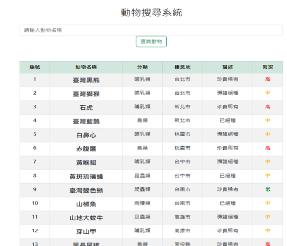

  <b>圖 10　動物搜尋系統</b> 
  系統預設顯示生態動物資料，使用者可輸入動物名稱進行查詢。

  

  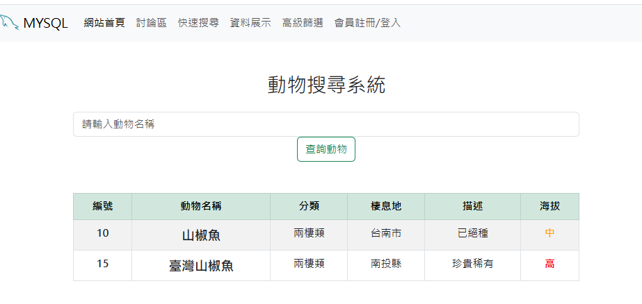

  <b>圖 11　動物搜尋結果</b> 
  輸入查詢條件後，系統會篩選並顯示符合條件的動物資料。

  

  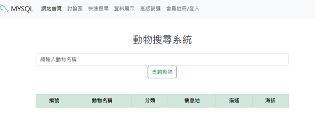

  <b>圖 12　查無符合資料</b> 
  當沒有符合搜尋條件的動物資料時，系統不顯示查詢結果。

 

---

## 4. 💬 生態留言板 (Message Board)

生態留言板提供使用者進行留言與交流，讓會員能分享生態相關資訊與內容。

留言資料會記錄留言者、留言日期及留言內容，並透過資料庫進行儲存與管理。

### 功能操作畫面

  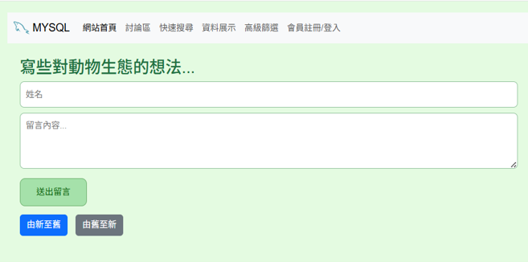

  <b>圖 13　生態留言板</b> 
  使用者可輸入姓名與留言內容，分享對生態相關議題的想法。

  

  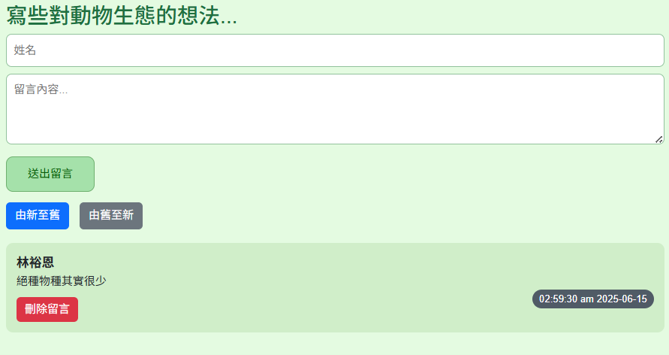

  <b>圖 14　新增留言</b> 
  送出留言後，系統會將留言內容與時間顯示於留言板中。

  

  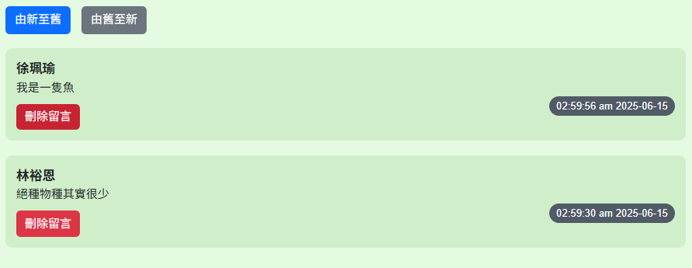

  <b>圖 15　留言由新至舊排序</b> 
  留言可依時間由新至舊排列，方便查看最新留言。

  

  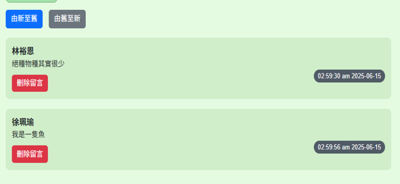

  <b>圖 16　留言由舊至新排序</b> 
  使用者亦可切換為由舊至新的排列方式瀏覽留言。

  

  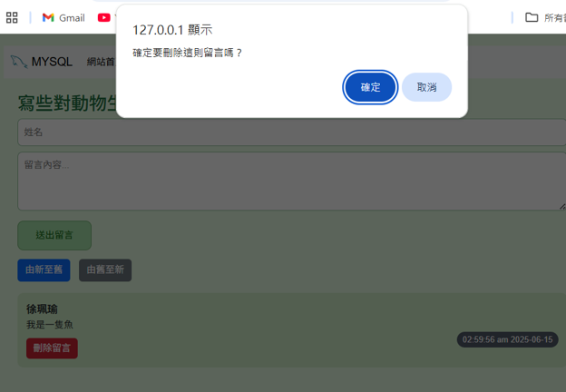

  <b>圖 17　刪除留言確認</b> 
  刪除留言前，系統會顯示確認視窗，避免誤刪留言資料。

  

  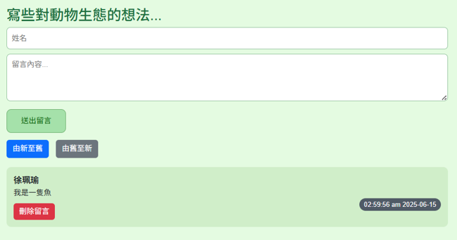

  <b>圖 18　留言刪除完成</b> 
  確認刪除後，系統會移除該筆留言並更新留言板內容。

 

---

## 5. 📊 數據分析 (Data Analysis)

數據分析功能將生態動物資料進行統計與視覺化，透過 **動態表格與長條圖** 呈現不同分類下的物種數量與分布情況。

使用者可透過圖表快速了解生態資料的分布與統計結果，使物種資訊更加直觀。

### 功能操作畫面

  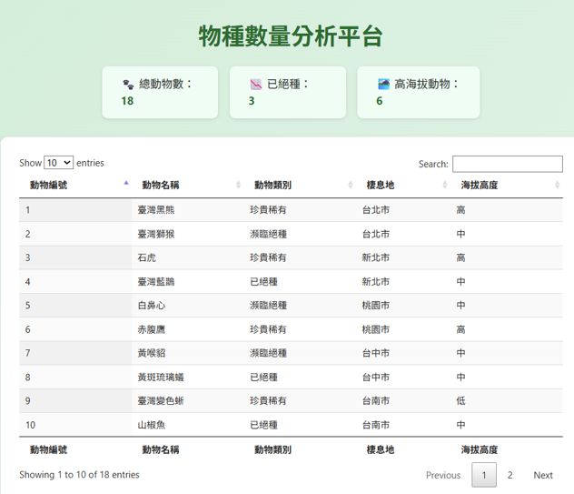

  <b>圖 19　物種數量分析平台</b> 
  系統提供物種總數、保育狀態與高海拔物種等統計資訊，並以動態表格呈現完整物種資料。

  

  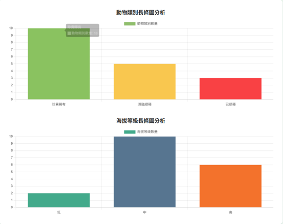

  <b>圖 20　物種數據圖表分析</b> 
  透過長條圖呈現不同動物類別與海拔等級的物種數量，使資料分布更加直觀。

  

  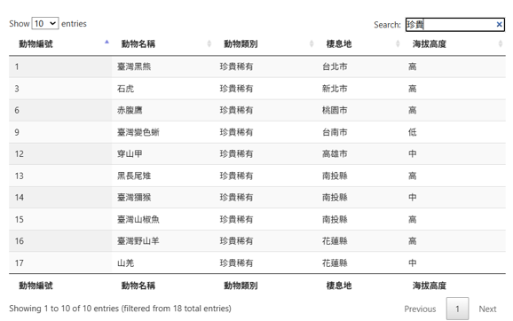

  <b>圖 21　資料關鍵字篩選</b> 
  使用者可透過搜尋欄輸入關鍵字，即時篩選表格中的相關物種資料。

  

  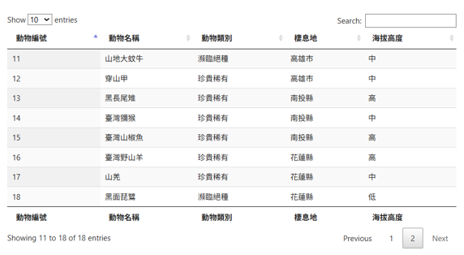

  <b>圖 22　資料表分頁瀏覽</b> 
  當資料筆數較多時，可透過分頁功能切換並瀏覽不同筆數的物種資料。

 

---

## 6. 🌿 網站首頁 (Homepage)

網站首頁整合系統主要功能入口，讓使用者可快速進入各項生態資訊與互動功能。

首頁以功能卡片方式呈現不同系統模組，使網站操作流程更加清楚且直觀。

### 功能操作畫面

  

  <b>圖 23　生態動物系統首頁</b> 
  首頁集中呈現系統主要功能入口，使用者可依需求快速進入各功能頁面。

